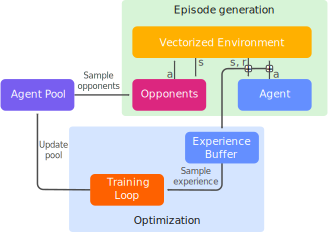

# BriscolaBot
Repository of the master thesis [**BriscolaBot: Mastering Briscola with model-free Deep Reinforcement Learning**](https://raw.githubusercontent.com/LetteraUnica/BriscolaBot/main/thesis/thesis.pdf)

We studied and implemented an AI Agent that plays Briscola, a famous italian card game.  
You can play against our latest agent, BriscolaBot-v3, [**on replit**](https://replit.com/@LorenzoCavuoti/BriscolaBot). Be careful, however! The agent achieves a 60% win rate against average human players, making it very difficult to beat.

## Training procedure



The agent plays a total of 2048 games against 4 opponents sampled from the Agent Pool. The agent collects experience during the episode generation and stores it in an Experience Buffer, which is then used to train the agent. After training with the PPO algorithm, a copy of the updated agent is inserted into the Agent Pool with frozen weights, and the process is repeated until the agent reaches the desired performance.

## Citing BriscolaBot
```latex
@misc{lorenzo2023briscolabot,
  author = {Lorenzo, Cavuoti},
  title = {BriscolaBot: Mastering Briscola with model-free Deep Reinforcement Learning},
  year = {2023},
  publisher = {GitHub},
  journal = {GitHub repository},
  howpublished = {\url{https://github.com/LetteraUnica/BriscolaBot}}
}
```
