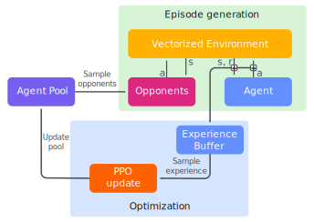

# BriscolaBot
Repository of the master thesis [**BriscolaBot: Mastering Briscola with model-free Deep Reinforcement Learning**](https://raw.githubusercontent.com/LetteraUnica/BriscolaBot/main/thesis/thesis.pdf)
Ie studied and implemented an AI Agent that plays Briscola, a famous italian card game.  

## Playing against the AI 🇬🇧
You can play against our latest agent BriscolaBot-v3 both locally and on replit

### On replit
1. Click the following link https://replit.com/@LorenzoCavuoti/BriscolaBot
2. Press Play
3. Enter fullscreen mode
  

### Locally
Copy paste the following in a bash terminal

```bash
git clone https://github.com/LetteraUnica/BriscolaBot.git;
cd BriscolaBot;
python3 -m pip install .;
python3 main.py
```

## Giocare contro l'AI 🇮🇹

Puoi giocare contro il nostro ultimo agente BriscolaBot-v3 sia in locale che su replit.
### Su replit
1. Clicca il seguente link https://replit.com/@LorenzoCavuoti/BriscolaBot
2. Premy Play
3. Entra in modalità a schermo intero
  

### In locale
Copia e incolla il seguente codice in un terminale bash.

```bash
git clone https://github.com/LetteraUnica/BriscolaBot.git;
cd BriscolaBot;
python3 -m pip install .;
python3 main.py
```

## Results
The agent wins against average human players 59% of the time. More impressive are the results against expert players, where BriscolaBot-v3 has won 52% of the games, with only one expert player Silvio, being able to beat it 12-11.  


<small>The black dashed line represents the 50% win rate, while the gray vertical lines represent the 90% confidence interval.</small>

All the human players we tested against expressed that the agent is very good at the game. One of the best performing players, Simone, found the agent frustrating to play against because it seemed to predict his hand cards.


## Training procedure



The agent plays a total of 2048 games against 4 opponents sampled from the Agent Pool. The agent collects this experience and stores it in an Experience Buffer, which is then used to train the agent. After training with the PPO algorithm, a copy of the updated agent is inserted into the Agent Pool with frozen weights, and the process is repeated until the agent reaches the desired performance. For more information read the [thesis](https://raw.githubusercontent.com/LetteraUnica/BriscolaBot/main/thesis/thesis.pdf) or explore the [notebook](https://github.com/LetteraUnica/BriscolaBot/blob/main/briscola.ipynb).

## Citing BriscolaBot
```latex
@misc{lorenzo2023briscolabot,
  author = {Lorenzo, Cavuoti},
  title = {BriscolaBot: Mastering Briscola with model-free Deep Reinforcement Learning},
  year = {2023},
  publisher = {GitHub},
  journal = {GitHub repository},
  howpublished = {\url{https://github.com/LetteraUnica/BriscolaBot}}
}
```
